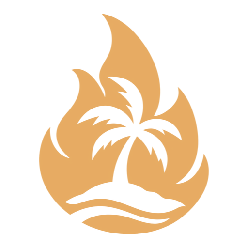
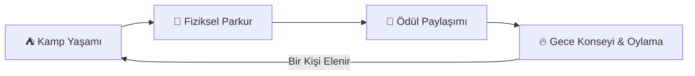
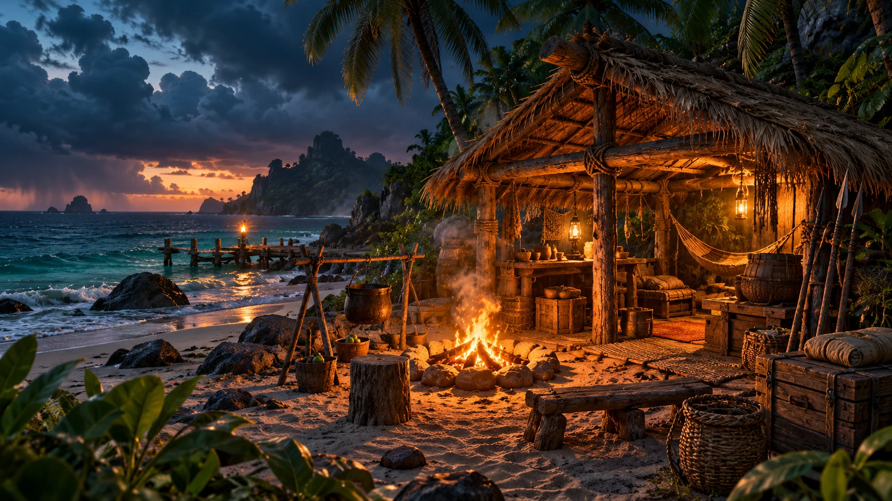
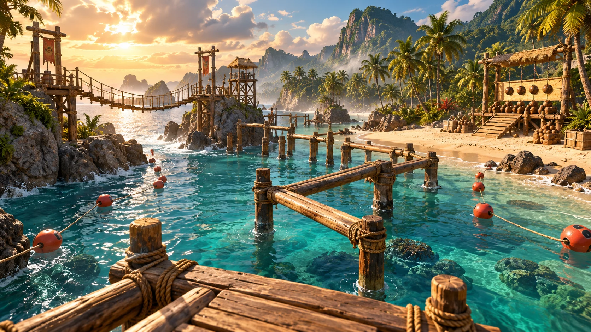

<p align="center">
  
</p>

<h1 align="center">Outvoters</h1>

<p align="center">
  <strong>Aynı ada. Farklı niyetler.</strong><br>
  Gündüz birlikte hayatta kal, parkurda yarış; akşam ateş başında birbirini oyla.
</p>

<p align="center">
  <a href="https://outvoters.com"></a>
  <a href="https://vercel.com"></a>
  <a href="https://cloudflare.com"></a>
  
  
</p>

---

<p align="center">
  
</p>

## 🏝️ Proje Hakkında

**Outvoters**, Steam için planlanan bağımsız (indie) bir 3D PC ada yarışması ve sosyal eleme oyunudur.

Bu depo, oyunun temel vizyonunu, atmosferini ve **çalışan 3 aşamalı oyun döngüsünü** tarayıcıda deneyimleten iki dilli (Türkçe & İngilizce) sinematik tanıtım sayfasını içerir.

> **Canlı Tanıtım ve İnteraktif Demo:** [https://outvoters.com](https://outvoters.com) *(veya [www.outvoters.com](https://www.outvoters.com))*

---

## 🎮 Temel Oyun Döngüsü

Oyun, klasik televizyon yarışması (Survivor) ruhunu modern çok oyunculu parti ve hayatta kalma dinamikleriyle birleştirir:



### 1. ⛺ Kamp Yaşamı & Ortak İhtiyaçlar
* Oyuncular yaklaşan fırtınaya karşı ortak barınak inşa eder, ateş yakar, yemek hazırlar ve dinlenir.
* Çatı tamamlanmazsa yağmurda ıslanıp enerji kaybedilir; enerji kaybı yarışmadaki performansı doğrudan etkiler.

### 2. 🏃 Fiziksel Parkur Yarışmaları
* **Yüzme & Rota Seçimi:** Güvenli uzun rota mı, açık denizdeki riskli kısa yol mu?
* **Islak İskele Dengesi:** Dar ahşap platformlar; acele eden suya düşer.
* **Hedefe Fırlatma:** Sınırlı atışla hedefleri vurma ve zamanlama yeteneği.
* **Takım Halinde Taşıma:** Ağır bir kalası fısıldaşarak koordine etmek ve taşımak.

### 3. 🎙️ Yakınlık Sesi (Proximity Voice Chat)
* **Kamp Ateşinde Sohbet:** Herkesin duyduğu genel stratejiler.
* **Ormanda Gizli Görüşmeler:** Ağaçların arasında iki kişinin kurduğu fısıltılı ittifaklar.
* **Konsey Tartışmaları:** Yüzleşme ve savunma anları.

### 4. 🔥 Akşam Konseyi, İttifak ve İhanet
* Gün batımında kamp ateşi etrafında toplanılır.
* Kimin eleneceğine oylarla karar verilir.
* **İzleyici Oylaması:** Yayıncı modunda Twitch sohbeti sonraki yarışmayı veya hava koşullarını oylayabilir; oylama riski belirler, oyuncunun becerisi sonucu değiştirir.

---

## 🎨 Konsept Galerisi

<table width="100%">
  <tr>
    <td width="50%" align="center">
      <br>
      <em>Akşam Kampı ve Palmiye Barınak</em>
    </td>
    <td width="50%" align="center">
      <br>
      <em>Kıyı Parkuru ve Hedef Atışı Alanı</em>
    </td>
  </tr>
</table>

---

## 🕹️ Web Prototipi (Tarayıcı Demosu)

Tanıtım sayfasında çalışan interaktif bir oyun döngüsü demosu yer alır:
1. **Kamp Hazırlığı:** Çatıyı tamamlama (güven kazanma), yemek hazırlama (enerji) veya dinlenme seçimi.
2. **Atış Yarışması:** Hareketli zamanlama barı ile 3 atışlık hedef mücadelesi (elle nişan alma erişilebilirlik modu mevcuttur).
3. **Ödül Konseyi:** Kazanılan ödülün kampta nasıl kullanılacağına dair oylama ve günün hikaye özeti.

---

## 🛠️ Tanıtım Sayfası Mimarisi

* **Teknoloji:** Semantik HTML5, modern CSS3 (Custom Properties, Grid, Fluid clamp typography), Vanilla JavaScript (sıfır bağımlılık).
* **Tipografi:** Barlow Condensed (karakterli başlıklar), Manrope (okunaklı gövde metinleri).
* **Erişilebilirlik:** Tam klavye navigasyonu, `prefers-reduced-motion` desteği, manuel nişan alma alternatifi.
* **Çift Dil (i18n):** Tek tıkla Türkçe / İngilizce anında dil geçişi.
* **Altyapı:**
  * **Dağıtım:** [Vercel](https://vercel.com) (`outvoters` projesi)
  * **DNS & SSL:** [Cloudflare](https://cloudflare.com) (Full SSL/TLS, Always Use HTTPS)

---

## 💻 Yerel Geliştirme

Statik dosyalar `dist/` klasöründedir. Herhangi bir statik sunucuyla çalıştırabilirsiniz:

```bash
# Projeyi klonlayın
git clone https://github.com/serhatkochan/outvoters.com.git
cd outvoters.com

# Statik sunucu başlatın
npx serve dist

# Veya Python ile:
python -m http.server 8080 --directory dist
```

Tarayıcınızda `http://localhost:3000` veya `http://localhost:8080` adresine gidin.

---

## 🚀 Yol Haritası

- [x] Oyun vizyonu ve marka kimliği (**Outvoters**)
- [x] Sinematik tanıtım sayfası ve interaktif konsept demosu
- [x] [outvoters.com](https://outvoters.com) alan adı ve DNS dağıtımı
- [ ] 3D küçük ada prototipi (temel hareket, yüzme ve fiziksel atış)
- [ ] Ortak barınak ve hava durumu/enerji simülasyonu
- [ ] Çok oyunculu (multiplayer) ağ altyapısı ve yakınlık mikrofonu entegrasyonu
- [ ] Steam mağaza sayfası ve ilk oynanabilir playtest

---

<p align="center">
  Geliştirici: <strong><a href="https://serhatkochan.com">Serhat Koçhan</a></strong>
</p>
